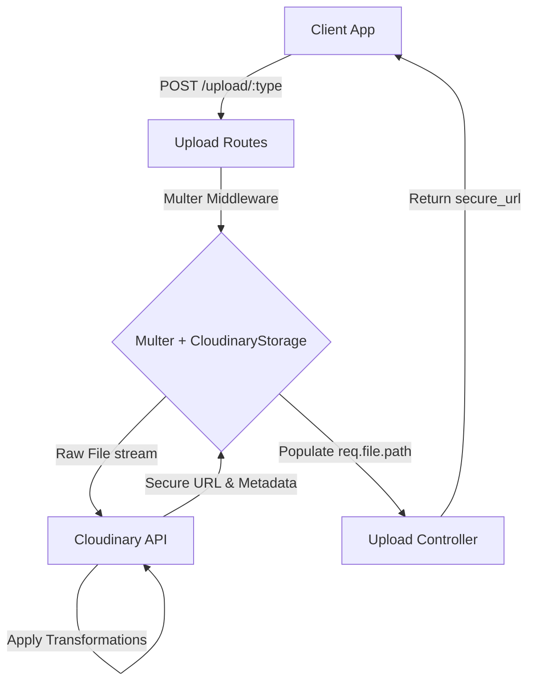

# File Upload & Image Optimization System (Backend)

This document describes the backend architecture, middleware configurations, and file processing pipeline for user uploads (avatars, logos, cover images, and other documents) in Workly.

---

## 1. Architecture Overview

Workly utilizes a hybrid file upload architecture using **Multer** and **Cloudinary**. Rather than performing local CPU-bound image manipulation on the server, the system delegates resizing, compression, and delivery format optimization directly to **Cloudinary's Upload API**.



---

## 2. Cloudinary Storage Configuration

We have three distinct storage profiles in `src/config/cloudinary.config.ts`. They configure Cloudinary's dynamic CDN transformations at upload time, ensuring that storage footprint is minimized and visual quality is preserved.

### A. Avatar Profile (`uploadAvatar`)

- **Purpose**: Personal user profile pictures (Job Seeker, Employer, Admin).
- **Ceiling (Raw Upload)**: Capped at `10MB` via Multer.
- **Transformations**:
  - **Dimensions**: 500x500 pixels.
  - **Cropping**: `fill` with `gravity: 'face'`. Cloudinary automatically detects and centers on human faces. If no face is found, it centers normally.
  - **Quality**: `auto:good`.
  - **Format**: `fetch_format: 'auto'` (automatically serves WebP/AVIF to compatible browsers).
  - **Folder**: `workly/avatars`

### B. Company Logo Profile (`uploadLogo`)

- **Purpose**: Brand identification logos displayed on job postings.
- **Ceiling (Raw Upload)**: Capped at `10MB`.
- **Transformations**:
  - **Dimensions**: Max 800x800 pixels.
  - **Cropping**: `limit`. Downsizes if the raw file is larger than 800px; never upscales or force-crops the aspect ratio.
  - **Transparency**: Preserved for PNGs.
  - **Quality**: `auto:good`.
  - **Folder**: `workly/logos`

### C. Cover Image Profile (`uploadCover`)

- **Purpose**: Banners for employer company pages.
- **Ceiling (Raw Upload)**: Capped at `15MB`.
- **Transformations**:
  - **Dimensions**: Max 1920px width.
  - **Cropping**: `limit`.
  - **Quality**: `auto:best` (biases toward visual fidelity over aggressive compression to keep banners crisp).
  - **Folder**: `workly/covers`

---

## 3. Dedicated Routes vs. Generic Uploads

### Dedicated Routes (Production-Grade Security)

We expose separate endpoints in `src/app/modules/upload/upload.route.ts`:

- `POST /upload/avatar` (uses `uploadAvatar` middleware)
- `POST /upload/logo` (uses `uploadLogo` middleware)
- `POST /upload/cover` (uses `uploadCover` middleware)

### Why Dedicated Endpoints?

1. **Strict File Size Guardrails**: Cap raw uploads per type. A cover image needs 15MB, but we can block malicious users from sending a 15MB file to the profile picture endpoint.
2. **Access Control (RBAC)**: Allows applying specific role-based permissions (e.g., only employers can hit `/upload/logo`).
3. **Decoupled Scaling**: In the future, individual upload targets can be rerouted to direct client-to-cloud presigned URLs or microservices without breaking a single generic route.

---

## 4. Request Life-Cycle Procedure

1. **Incoming Request**: Client triggers a `POST` request to `/upload/avatar` with a `multipart/form-data` payload containing the file.
2. **Multer Interception**: The respective Multer middleware (e.g., `uploadAvatar`) intercepts the upload.
3. **Direct Streaming**: The file stream is piped directly to Cloudinary's upload stream.
4. **Cloudinary Processing**: Cloudinary applies the predefined transformation (e.g., face detection, resizing) and stores the asset.
5. **Controller Hand-off**: Multer populates `req.file` with Cloudinary metadata. Crucially, `(req.file as any).path` holds the secure delivery URL.
6. **Response Generation**: The controller calls `uploadService.handleSingleUpload(req)` which extracts the URL and returns it to the client:
   ```json
   {
     "success": true,
     "statusCode": 200,
     "message": "File uploaded successfully",
     "data": {
       "url": "https://res.cloudinary.com/..."
     }
   }
   ```

---

## 5. Generic / Chat Attachment Upload Flow

For chatbox attachments, resumes, and other documents that must remain raw (uncompressed and unmodified), the system routes uploads through the generic `/upload/single` and `/upload/multiple` endpoints.

### Key Configurations:

- **Middleware (`upload`)**: Configured with standard `multer.memoryStorage()` and a generic mime-type filter (allowing images, PDFs, and videos).
- **Direct Uploading**: The raw file buffer is streamed directly to Cloudinary folder `workly-job/uploads` using `cloudinary.uploader.upload_stream` without any upload-time image transformations.
- **Visual/File Fidelity**: Since no transformations are applied, all PDFs, video recordings, high-resolution chat image attachments, and office files are saved on the Cloudinary CDN in their original state.
