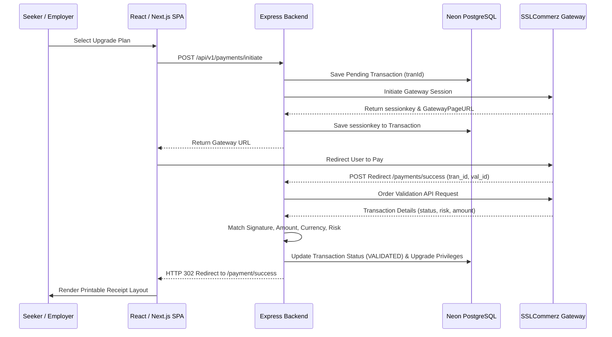

# SSLCommerz Payment Gateway Integration & Security Reference

This document outlines the architecture, data schema, secure verification workflows, and environment setups of the **SSLCommerz Secure Payment Integration** implemented in the WorklyJob Backend.

---

## 1. System Overview

The payment system is designed to provide secure, production-grade subscription upgrades for corporate **Employers** (Starter, Pro, Enterprise plans) and high-profile candidate boosts for **Job Seekers**. It integrates directly with the **SSLCommerz API** using the official `sslcommerz-lts` engine.

### Transaction Lifecycle Flow



---

## 2. Strict Security Auditing Controls

To prevent request-forgery, transaction hijacking, price tampering, or race conditions, the system implements **six levels of defensive multi-point checks**:

### A. Alphabetic Signature HMAC Verification

The callback request contains `verify_sign` and `verify_key`. The service extracts parameters based on `verify_key`, sorts them alphabetically, calculates the MD5 signature hash using the store password MD5 hash, and compares it to the incoming signature.

```typescript
// 1. Sort fields from verify_key alphabetically
const keys = verify_key.split(",").sort();
// 2. Compute store_passwd MD5
const storePasswdHash = crypto
  .createHash("md5")
  .update(config.sslcommerz.store_passwd)
  .digest("hex");
// 3. Match MD5 of query string against verify_sign
```

### B. Gateway-to-Gateway Validation Check

Instead of relying on browser response parameters, the server makes a synchronous server-to-server request calling the **Order Validation API** (`sslcz.validate({ val_id })`) to verify the transaction's legitimacy directly.

### C. Multi-Point Value Reconciliation

Ensures the transaction wasn't intercepted and tampered with:

- Matches exact `amount` validated by the gateway against the database record.
- Matches exact `currency` (default `"BDT"`) to prevent conversion spoofing.

### D. Fraud & Risk Auditing

- Filters transactions containing `risk_level === 1` (flagged by SSLCommerz as suspicious).
- Holds the automatic upgrade benefits and marks the transaction as `PENDING_REVIEW` for manual administrative oversight.

### E. Active Subscription Double-Purchase Guard (SaaS Rule)

Before creating a checkout session or accepting a payment, the backend checks if the Seeker or Employer Company holds an active, unexpired subscription to the targeted plan tier. If a live subscription exists, the checkout is blocked and throws a `400 Bad Request` validation payload.

### F. Concurrency Barrier & Idempotency Lock

To prevent race conditions where a customer's success page redirect and the background IPN webhook arrive at the server simultaneously, validation runs inside a database transaction lock. The very first action inside `prisma.$transaction` re-fetches the transaction state:

```typescript
const currentTx = await tx.paymentTransaction.findUnique({
  where: { id: transaction.id },
});
if (currentTx.status === PaymentStatus.VALIDATED) {
  return currentTx; // Blocks secondary concurrent processes from double-upgrades
}
```

---

## 3. Database Schema

### Table: `payment_transactions`

The physical table is defined as follows:

| Column        | Type                   | Attributes         | Description                                                              |
| :------------ | :--------------------- | :----------------- | :----------------------------------------------------------------------- |
| `id`          | `String (UUID)`        | `Primary Key`      | System internal identifier.                                              |
| `tranId`      | `String (VarChar 30)`  | `Unique, Index`    | Unique transaction ID format: `TXN-[13 char epoch]-[4 random]`.          |
| `valId`       | `String (VarChar 100)` | `Nullable`         | SSLCommerz Validation ID.                                                |
| `sessionKey`  | `String (VarChar 255)` | `Nullable`         | Session key generated on checkout.                                       |
| `userId`      | `String (UUID)`        | `Index`            | Foreign Key pointing to `users`.                                         |
| `companyId`   | `String (UUID)`        | `Index, Nullable`  | Foreign Key pointing to `companies`.                                     |
| `amount`      | `Float`                | `Mandatory`        | Payable amount in BDT.                                                   |
| `currency`    | `String (VarChar 10)`  | `Default: BDT`     | Currency of purchase.                                                    |
| `status`      | `PaymentStatus`        | `Default: PENDING` | States: `PENDING`, `VALIDATED`, `PENDING_REVIEW`, `FAILED`, `CANCELLED`. |
| `category`    | `PaymentCategory`      | `Mandatory`        | Categories: `EMPLOYER_PLAN`, `SEEKER_PREMIUM`.                           |
| `planId`      | `String (VarChar 100)` | `Mandatory`        | Targeted subscription plan name (e.g. `starter`, `pro`).                 |
| `cardType`    | `String (VarChar 100)` | `Nullable`         | Payment provider used (e.g. `BKASH`, `VISA`).                            |
| `bankTranId`  | `String (VarChar 100)` | `Nullable`         | Bank Transaction Identifier.                                             |
| `storeAmount` | `Float`                | `Nullable`         | Net amount received after merchant fees.                                 |
| `riskLevel`   | `Int`                  | `Default: 0`       | Fraud auditing scale.                                                    |

---

## 4. REST API Endpoint Registry

All routes are prefixed with `/api/v1/payments`.

### A. Initiate Payment Session

- **Path**: `/initiate`
- **Method**: `POST`
- **Auth**: `EMPLOYER`, `JOB_SEEKER`
- **Request Body**:
  ```json
  {
    "planId": "pro",
    "category": "EMPLOYER_PLAN",
    "amount": 4999,
    "currency": "BDT",
    "cusName": "Jane Doe",
    "cusEmail": "jane@company.com",
    "cusPhone": "01712345678"
  }
  ```
- **Response (200)**:
  ```json
  {
    "success": true,
    "data": {
      "gatewayUrl": "https://sandbox.sslcommerz.com/gwprocess/v4/api.php?...",
      "tranId": "TXN-1716891234567-9921"
    }
  }
  ```

### B. Gateway Success Redirect Callback

- **Path**: `/success`
- **Method**: `POST`
- **Auth**: `Public` (Called by SSLCommerz server).
- **Action**: Performs multi-point security validations, upgrades database privileges, and redirects client browser: `302 Redirect -> ${CLIENT_URL}/payment/success?tranId=${tranId}&amount=${amount}`.

### C. Gateway Fail Redirect Callback

- **Path**: `/fail`
- **Method**: `POST`
- **Auth**: `Public`.
- **Action**: Marks status as failed, redirects client: `302 Redirect -> ${CLIENT_URL}/payment/fail?tranId=${tranId}`.

### D. Gateway Cancel Redirect Callback

- **Path**: `/cancel`
- **Method**: `POST`
- **Auth**: `Public`.
- **Action**: Marks status as cancelled, redirects client: `302 Redirect -> ${CLIENT_URL}/payment/cancel?tranId=${tranId}`.

### E. Instant Payment Notification (IPN) Hook

- **Path**: `/ipn`
- **Method**: `POST`
- **Auth**: `Public` (Server-to-Server backup webhook).
- **Action**: Double-checks and completes payment in the background if the customer closed the browser during checkout.

### F. Retrieve Transaction History

- **Path**: `/transactions`
- **Method**: `GET`
- **Auth**: `All roles` (Filters for regular users, returns complete logs for admins).
- **Params**: `page`, `limit` (Supports pagination).

---

## 5. Environment Configuration

Add the following to your backend `.env` file:

```env
# SSLCommerz credentials
SSLCOMMERZ_STORE_ID=your_store_id
SSLCOMMERZ_STORE_PASSWD=your_store_password
SSLCOMMERZ_IS_LIVE=false # true for production, false for sandbox

# URL endpoints
BACKEND_URL=http://localhost:5000
FRONTEND_URL=http://localhost:3000
```

### Zod Boolean Coercion Gotcha Fix

When parsing environment variables with Zod schemas, using `z.coerce.boolean()` translates any non-empty string value (including `"false"`) into a boolean `true`. Because of this, setting `SSLCOMMERZ_IS_LIVE=false` in `.env` would traditionally get parsed as `true`, causing the server to communicate with the live gateway rather than the sandbox environment.

The system resolves this by utilizing `z.preprocess()` to ensure `"false"` and `"0"` correctly resolve as boolean `false`:

```typescript
SSLCOMMERZ_IS_LIVE: z.preprocess(
  (val) => val === "true" || val === "1" || val === true,
  z.boolean(),
).default(false);
```

### CORS Configuration & Redirect Handling

To prevent CORS errors when SSLCommerz redirects clients back to the backend success endpoints, the backend's allowed origins are automatically merged:

```typescript
const allowedOrigins = [
  ...env.ALLOWED_ORIGINS.split(",").map((o) => o.trim()),
  env.BACKEND_URL,
  env.FRONTEND_URL,
  "http://localhost:3000",
  "http://localhost:5000",
].filter(Boolean);
```

This guarantees local environments and sandbox validation redirects operate seamlessly.
