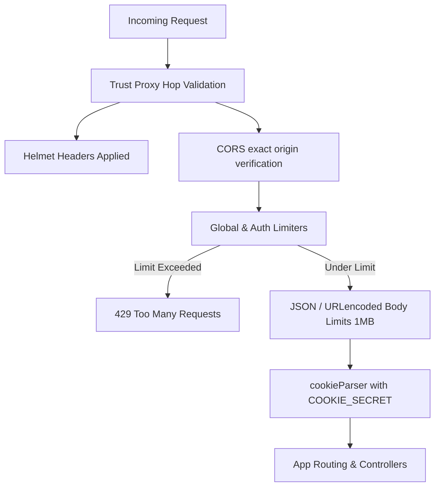
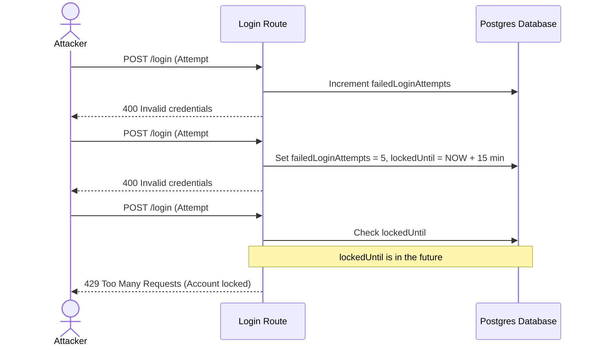
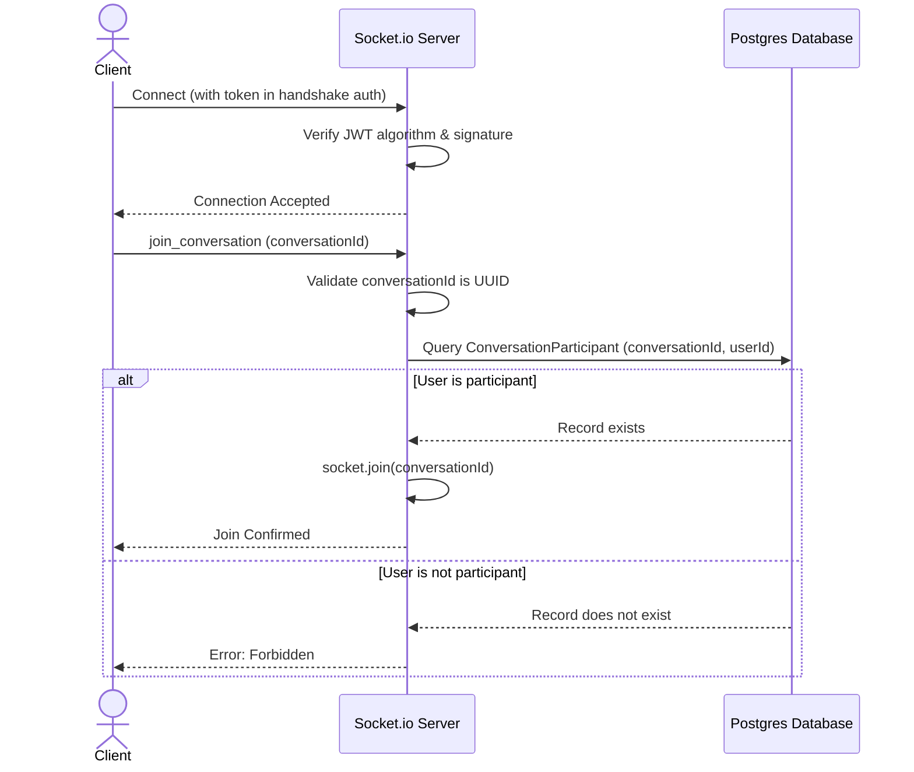

# Workly Job Portal — Security Architecture & Hardening Documentation

This document describes the security controls, threat mitigation strategies, and architectural improvements implemented in the Workly Job Portal Backend during the **Security Hardening v2 (July 2026)** initiative.

These updates align the codebase with enterprise security standards, mitigates OWASP Top 10 API Security vulnerabilities, and enforces secure-by-design defaults across configuration, authentication, transport layers, database access, and real-time sockets.

---

## 1. System Topology & Design Principles

The backend is built around three core architectural tenets:

1. **Fail-Closed on Security Gates:** Any parsing error, validation failure, authentication check, or BOLA assertion blocks the request path and returns a clean, safe response (e.g., standard `400` or `404` errors).
2. **Fail-Open on Availability-Affecting Side Effects:** Non-critical operations (such as rate limiter Redis communication issues or push notification delivery errors) degrade gracefully to in-memory fallbacks or continue processing, ensuring security measures do not induce self-inflicted service outages.
3. **Unified Environment State:** A single validated schema determines environment behaviour, eliminating split configuration discrepancies that allow testing routes or seed features to run in production.

---

## 2. Deep Dive: Hardened Security Components

### 2.1 Startup Configuration & Validation (Fail-Fast)

- **File Reference:** [`src/config/index.ts`](file:///home/muzahid/MainDrive/Developments/MyPortfolio/PERN-Stack/Workly-Job/Web/Workly_Server/src/config/index.ts)
- **Vulnerability Mitigated:** Secret exposure, missing environment keys, misconfiguration on boot.
- **Mechanism:**
  - Standardised runtime configurations using a strict Zod validator (`envSchema`).
  - The server refuses to start (`process.exit(1)`) if any required secret or URL is missing or malformed, avoiding half-configured runtime states.
  - Enforced a minimum size of 32 characters for encryption keys (`JWT_SECRET`, `JWT_REFRESH_SECRET`, `COOKIE_SECRET`).
  - Merged testing and runtime environment gates (`ENVIRONMENT` and `NODE_ENV`) into a single source of truth (`env.NODE_ENV`).

### 2.2 Double-Guarded Seed Protection

- **File References:** [`src/server.ts`](file:///home/muzahid/MainDrive/Developments/MyPortfolio/PERN-Stack/Workly-Job/Web/Workly_Server/src/server.ts), [`prisma/seed.ts`](file:///home/muzahid/MainDrive/Developments/MyPortfolio/PERN-Stack/Workly-Job/Web/Workly_Server/prisma/seed.ts)
- **Vulnerability Mitigated:** Unauthorized production database wipes/overwrites; exposure of test login credentials.
- **Mechanism:**
  - Placed an immutable guard inside the `seedDevUsers()` entry point, throwing a runtime exception if `env.NODE_ENV === "production"`.
  - Added a CLI-level environment guard at the top of the standalone Prisma seed script (`prisma/seed.ts`) which exits immediately if run against a database mapped to production, preventing data loss in staging or production.

### 2.3 Strict Transport Layer Security (TLS/SSL) & Prisma Omissions

- **File References:** [`src/utils/prismaClient.ts`](file:///home/muzahid/MainDrive/Developments/MyPortfolio/PERN-Stack/Workly-Job/Web/Workly_Server/src/utils/prismaClient.ts), [`prisma.config.ts`](file:///home/muzahid/MainDrive/Developments/MyPortfolio/PERN-Stack/Workly-Job/Web/Workly_Server/prisma.config.ts)
- **Vulnerability Mitigated:** Man-in-the-Middle (MitM) sniffing, database credential hijacking, password hash leaks via REST APIs.
- **Mechanism:**
  - Restructured PostgreSQL connections to validate certificates against system CAs. Custom configurations load root certificates via `env.DB_CA_CERT_PATH`. Disallowed wildcard configuration switches (such as `rejectUnauthorized: false`).
  - Leveraged Prisma 7's global query omission engine to strip `passwordHash` fields at the query-engine level. This prevents sensitive hash data from ever being returned to Express controllers, providing a global backstop even if explicit select arrays are omitted.

### 2.4 Rate Limiting & DoS Mitigation

- **File References:** [`src/lib/rateLimitStore.ts`](file:///home/muzahid/MainDrive/Developments/MyPortfolio/PERN-Stack/Workly-Job/Web/Workly_Server/src/lib/rateLimitStore.ts), [`src/lib/rateLimiters.ts`](file:///home/muzahid/MainDrive/Developments/MyPortfolio/PERN-Stack/Workly-Job/Web/Workly_Server/src/lib/rateLimiters.ts), [`src/app.ts`](file:///home/muzahid/MainDrive/Developments/MyPortfolio/PERN-Stack/Workly-Job/Web/Workly_Server/src/app.ts)
- **Vulnerability Mitigated:** Denial of Service (DoS), brute force credential validation, memory exhaustion.
- **Mechanism:**
  - Implemented an optional Redis-backed rate-limiting store. If `REDIS_URL` is omitted, the rate limiter degrades gracefully to in-memory tracking with a startup warning.
  - Placed a `globalLimiter` (100 req/15min) on the application instance.
  - Placed a strict `authLimiter` (5 req/15min) targeting auth mutations (`/login`, `/register`, `/forgot-password`, `/reset-password`). Set `skipSuccessfulRequests: true` so legitimate users logging in are never penalized, while attackers scanning for passwords are blocked.
  - Reduced payload limits on body-parser parsing middleware (`json`, `urlencoded`) from a vulnerable `50mb` threshold down to `1mb`.

### 2.5 Authentication Integrity & BOLA Protections

- **File References:** [`src/app/middleware/authValidator.ts`](file:///home/muzahid/MainDrive/Developments/MyPortfolio/PERN-Stack/Workly-Job/Web/Workly_Server/src/app/middleware/authValidator.ts), [`src/app/middleware/ownershipGuard.ts`](file:///home/muzahid/MainDrive/Developments/MyPortfolio/PERN-Stack/Workly-Job/Web/Workly_Server/src/app/middleware/ownershipGuard.ts), [`src/app/modules/auth/auth.service.ts`](file:///home/muzahid/MainDrive/Developments/MyPortfolio/PERN-Stack/Workly-Job/Web/Workly_Server/src/app/modules/auth/auth.service.ts), [`src/app/modules/auth/auth.validation.ts`](file:///home/muzahid/MainDrive/Developments/MyPortfolio/PERN-Stack/Workly-Job/Web/Workly_Server/src/app/modules/auth/auth.validation.ts)
- **Vulnerability Mitigated:** Algorithm-confusion attacks (CVE-2022-23529 type), privilege self-elevation, brute force login, Broken Object-Level Authorization (BOLA).
- **Mechanism:**
  - Added strict algorithm pinning (`algorithms: [env.JWT_ALGORITHM]`) on all token validation calls (middleware, socket handshakes, and maintenance state verification).
  - Restructured RBAC logic: if a path allows `ADMIN`, `SUPER_ADMIN` automatically inherits that authority. Explicit `SUPER_ADMIN`-only paths can be created by leaving `ADMIN` out of the role validator array.
  - Restricted registration schemas: public endpoints only allow `JOB_SEEKER` or `EMPLOYER` roles. Administrative assignments (`ADMIN`/`SUPER_ADMIN`) must be executed explicitly by a verified administrator.
  - Capped passwords to a maximum of 72 characters, matching bcrypt's silent truncation limit and avoiding potential CPU-exhaustion vectors.
  - Implemented an account lockout mechanism inside the database (5 failed login attempts locks the user account for 15 minutes, verifying block status before executing bcrypt operations).
  - Created a BOLA ownership guard (`assertOwnsOrThrow`). If a resource owner does not match the requesting user (or their company context), the guard throws a `404 Not Found` rather than a `403 Forbidden`. This avoids confirming the existence of records to unauthorized probes.

### 2.6 Socket.io Handshake & Event Security

- **File Reference:** [`src/socket/index.ts`](file:///home/muzahid/MainDrive/Developments/MyPortfolio/PERN-Stack/Workly-Job/Web/Workly_Server/src/socket/index.ts)
- **Vulnerability Mitigated:** Cross-Site WebSocket Hijacking (CSWSH), unauthorized room eavesdropping, large payload socket crash (DoS).
- **Mechanism:**
  - Restricted Socket.io CORS origin checking to strictly check the exact-match array of origins (`env.ALLOWED_ORIGINS`).
  - Added algorithm pinning to the socket handshake JWT verification middleware.
  - Added Zod schemas to validate all client socket events (`join_conversation`, `leave_conversation`, `typing`), discarding malformed payloads.
  - Added verification queries inside the socket lifecycle before joining rooms. When a client requests to join a conversation room, the server checks if their authenticated `userId` is a participant in the conversation (`ConversationParticipant`), preventing eavesdropping.

### 2.7 Production Sanitisation & Information Disclosure

- **File References:** [`src/app/middleware/globalErrorHandler.ts`](file:///home/muzahid/MainDrive/Developments/MyPortfolio/PERN-Stack/Workly-Job/Web/Workly_Server/src/app/middleware/globalErrorHandler.ts), [`src/app/middleware/maintenanceMode.middleware.ts`](file:///home/muzahid/MainDrive/Developments/MyPortfolio/PERN-Stack/Workly-Job/Web/Workly_Server/src/app/middleware/maintenanceMode.middleware.ts)
- **Vulnerability Mitigated:** Database schema leaks, internal filesystem paths exposure.
- **Mechanism:**
  - Configured `globalErrorHandler` to intercept all 5xx errors and database anomalies (Prisma errors matching `P1xxx` or `P2xxx` codes) in production. It replaces these messages with a generic `"Internal server error"`, blocking table names, columns, or connection queries from leaking.
  - Retained descriptive error messages for intentional client errors (4xx validation exceptions).
  - Ensured stack traces (`error.stack`) are never included in API responses.

---

## 3. High-Risk Workflows & Lifecycle Diagrams

### 3.1 Rate Limiting Middleware Pipeline



### 3.2 Account Lockout Sequence



### 3.3 Socket.io Authorization lifecycle



---

## 4. Verification Checklists

### 4.1 Verification Commands

To check for correct types and configurations locally, execute the following commands:

```bash
# 1. Install newly introduced packages
yarn add ioredis rate-limit-redis pino pino-http csrf-csrf

# 2. Run Prisma migration for database lockout and refresh token models
npx prisma migrate dev --name security_hardening_v2

# 3. Check for compile errors
yarn type-check
```

### 4.2 Security Checklist

- [ ] Verify that starting the server with invalid or missing variables inside `.env` exits immediately on boot.
- [ ] Verify that hitting `/api/v1/auth/register` with `"role": "ADMIN"` returns a `400 Bad Request` validation error.
- [ ] Verify that hitting `/api/v1/auth/login` 5 times with a wrong password locks the user account for 15 minutes.
- [ ] Verify that sending requests from a mock client with `Origin: http://sslcommerz.com.attacker.io` returns a CORS rejection.
- [ ] Verify that database query anomalies (e.g. invalid UUID lookups causing database errors) return a generic `"Internal server error"` response body in production.
