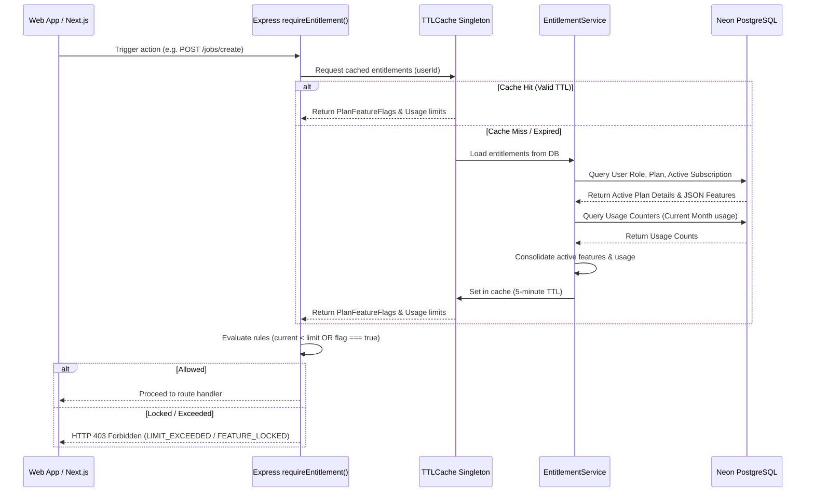
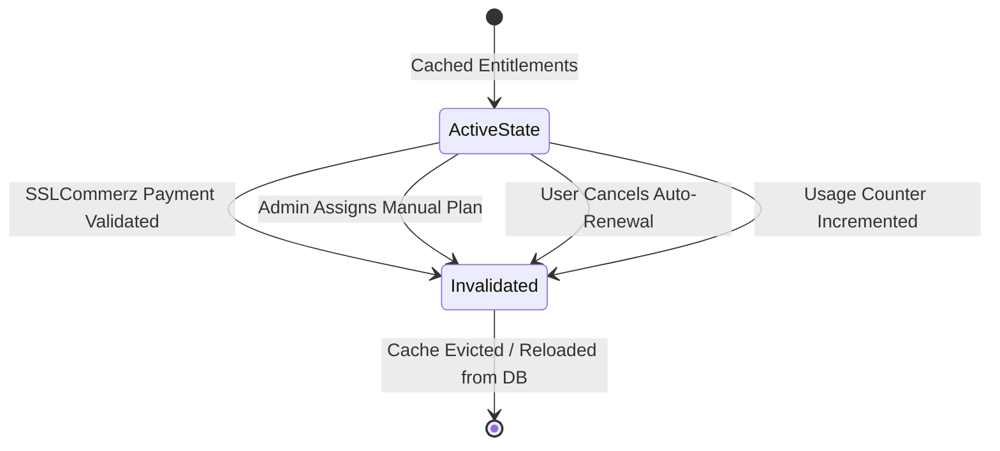

# Subscription & Entitlement Gating System Reference

This document outlines the architecture, cache strategies, databases schemas, REST API endpoints, and client hooks that form the **Subscription & Entitlement System** of the WorklyJob ecosystem.

---

## 1. Architectural Architecture Overview

The Subscription & Entitlement gating system is designed to provide role-based access control, limit validation, and real-time feature gating for both **Employers** (Free, Growth, Enterprise plans) and **Job Seekers** (Free, Pro, Premium plans).

To minimize database overhead, the backend leverages an in-process, generic, thread-safe **TTL Caching Engine** to cache user entitlement flags. This structure guarantees that typical page actions (checking if a user can post a job, upload a resume, or send a message) execute in sub-millisecond times without query-latency.

### Entitlement Verification Flow



---

## 2. Database Schema

The gating system relies on the following database model schemas declared in `schema.prisma`:

### Model: `Plan`

Defines available packages, BDT pricing, intervals, and entitlement flags.

| Field           | Type       | Attributes                    | Description                              |
| :-------------- | :--------- | :---------------------------- | :--------------------------------------- |
| `id`            | `String`   | `Primary Key (UUID)`          | Internal unique identifier               |
| `name`          | `String`   | `Unique (with type)`          | Plan name (e.g. `Free`, `Pro`, `Growth`) |
| `planType`      | `PlanType` | `Enum: EMPLOYER / JOB_SEEKER` | Targeted user role                       |
| `description`   | `String`   | `Nullable`                    | Plan description for UI catalog          |
| `price`         | `Float`    | `Mandatory`                   | Billing interval amount                  |
| `currency`      | `String`   | `Default: BDT`                | Pricing currency                         |
| `interval`      | `String`   | `Default: month`              | Billing cycle (e.g. `month`, `year`)     |
| `features`      | `Json`     | `Mandatory`                   | JSON object containing feature toggles   |
| `maxActiveJobs` | `Int`      | `Nullable`                    | Maximum active job posts allowed         |
| `maxUsers`      | `Int`      | `Nullable`                    | Maximum team members allowed (Employer)  |
| `isActive`      | `Boolean`  | `Default: true`               | Admin status toggle                      |
| `isCustom`      | `Boolean`  | `Default: false`              | Sales-gated custom plans                 |

### Model: `Subscription` (Employer)

Stores active plan state for corporate companies.

| Field               | Type                 | Attributes       | Description                                    |
| :------------------ | :------------------- | :--------------- | :--------------------------------------------- |
| `id`                | `String`             | `Primary Key`    | Internal identifier                            |
| `companyId`         | `String`             | `Unique, FK`     | Pointer to the Employer's `Company`            |
| `planId`            | `String`             | `FK`             | Pointer to active `Plan`                       |
| `status`            | `SubscriptionStatus` | `Enum`           | Status: `ACTIVE`, `CANCELLED`, `EXPIRED`, etc. |
| `startDate`         | `DateTime`           | `Mandatory`      | Start of active billing period                 |
| `endDate`           | `DateTime`           | `Nullable`       | Expiry of active billing period                |
| `autoRenew`         | `Boolean`            | `Default: true`  | Automated checkout renewal flag                |
| `cancelAtPeriodEnd` | `Boolean`            | `Default: false` | Set true when user cancels auto-renewal        |

### Model: `UserSubscription` (Job Seeker)

Stores active plan state for job seekers.

| Field               | Type                 | Attributes       | Description                                    |
| :------------------ | :------------------- | :--------------- | :--------------------------------------------- |
| `id`                | `String`             | `Primary Key`    | Internal identifier                            |
| `userId`            | `String`             | `Unique, FK`     | Pointer to target `User` (Job Seeker)          |
| `planId`            | `String`             | `FK`             | Pointer to active `Plan`                       |
| `status`            | `SubscriptionStatus` | `Enum`           | Status: `ACTIVE`, `CANCELLED`, `EXPIRED`, etc. |
| `startDate`         | `DateTime`           | `Mandatory`      | Start of active billing period                 |
| `endDate`           | `DateTime`           | `Nullable`       | Expiry of active billing period                |
| `autoRenew`         | `Boolean`            | `Default: true`  | Automated checkout renewal flag                |
| `cancelAtPeriodEnd` | `Boolean`            | `Default: false` | Set true when user cancels auto-renewal        |

### Model: `UsageCounter`

Tracks current quota consumption for numeric entitlements. Counters reset monthly.

| Field                   | Type       | Attributes    | Description                             |
| :---------------------- | :--------- | :------------ | :-------------------------------------- |
| `id`                    | `String`   | `Primary Key` | Internal identifier                     |
| `userId`                | `String`   | `Unique, FK`  | Pointer to target `User`                |
| `jobsPosted`            | `Int`      | `Default: 0`  | Total active jobs posted                |
| `applicationsSubmitted` | `Int`      | `Default: 0`  | Job applications submitted this month   |
| `resumesUploaded`       | `Int`      | `Default: 0`  | Total active resumes maintained on file |
| `updatedAt`             | `DateTime` | `Updated`     | Last limit consumption timestamp        |

---

## 3. Quota & Feature Flags Grid

The standard seeded packages enforce the following entitlement restrictions across all roles:

### A. Employer Plans (PlanType: `EMPLOYER`)

| Entitlement Metric                             |  Free  |   Growth   |    Enterprise     |
| :--------------------------------------------- | :----: | :--------: | :---------------: |
| **Price (Monthly)**                            | ৳0 BDT | ৳7,999 BDT |    ৳24,999 BDT    |
| **Active Job Limit** (`maxActiveJobs`)         |   1    |     10     | 9,999 (Unlimited) |
| **Team Users** (`maxUsers`)                    |   1    |     4      | 9,999 (Unlimited) |
| **Direct Messaging** (`canMessage`)            | ❌ No  |   ✅ Yes   |      ✅ Yes       |
| **Performance Analytics** (`canViewAnalytics`) | ❌ No  |   ✅ Yes   |      ✅ Yes       |

### B. Job Seeker Plans (PlanType: `JOB_SEEKER`)

| Entitlement Metric                                 |  Free  |   Pro    |      Premium      |
| :------------------------------------------------- | :----: | :------: | :---------------: |
| **Price (Monthly)**                                | ৳0 BDT | ৳399 BDT |     ৳999 BDT      |
| **Applications / Mo** (`maxMonthlyApplications`)   |   40   |   120    | 9,999 (Unlimited) |
| **Resumes Maintained** (`maxResumes`)              |   1    |    5     | 9,999 (Unlimited) |
| **Direct Messaging** (`canMessageEmployer`)        | ❌ No  |  ✅ Yes  |      ✅ Yes       |
| **View Profile Views** (`canViewProfileAnalytics`) | ❌ No  |  ✅ Yes  |      ✅ Yes       |
| **Featured Badge** (`isFeaturedProfile`)           | ❌ No  |  ❌ No   |      ✅ Yes       |

---

## 4. Backend Engine Components

### A. In-Memory TTL Cache Engine (`src/utils/entitlement.cache.ts`)

A generic `TTLCache` class that stores cached values along with expiration times. Expired entries are deleted lazily on request.
Two singletons are exported:

- `entitlementCache`: For user entitlements (5-minute TTL).
- `planCache`: For subscription plans metadata (1-hour TTL).

### B. Entitlement Service Core (`src/services/entitlement.service.ts`)

The `EntitlementService` handles the following operations:

- `getCurrentUsage(userId)`: Resolves job, application, and resume consumption metrics.
- `getUserEntitlements(userId)`: Compiles the user's role-based entitlements and active limits. Admin bypass automatically overrides limits with maximum values.
- `checkEntitlement(userId, feature)`: Determines whether a user has access to a specific toggle feature or if they are within quota limits.
- `incrementUsage(userId, counterField, amount)`: Safely increments quota counts when users complete actions.
- `invalidateCache(userId)`: Cleans cached metadata instantly to reflect modifications.

### C. Access Gating Middleware (`src/app/middleware/requireEntitlement.ts`)

An Express middleware wrapper that blocks access to endpoints when limits are exceeded. Returns an explicit structured error response.

```typescript
import { Request, Response, NextFunction } from "express";
import { EntitlementService } from "../../services/entitlement.service.js";
import { PlanFeatureFlags } from "../../types/subscription.types.js";

export const requireEntitlement = (feature: keyof PlanFeatureFlags) => {
  return async (req: Request, res: Response, next: NextFunction) => {
    try {
      const userId = req.user?.id;
      const isAllowed = await EntitlementService.checkEntitlement(userId, feature);

      if (!isAllowed) {
        return res.status(403).json({
          success: false,
          message: "Feature locked or monthly limit exceeded.",
          error: {
            code: "LIMIT_EXCEEDED",
            feature,
          },
        });
      }
      next();
    } catch (error) {
      next(error);
    }
  };
};
```

---

## 5. Cache Invalidation & Operational Lifecycle

To ensure data integrity, the system clears cached user entitlement configurations whenever one of the following lifecycle hooks triggers:



1.  **SSLCommerz Validation**: When the server completes checkout validation via `/success` or `/ipn`, the active `Subscription` (Employer) or `UserSubscription` (Seeker) is created or updated, and the user cache is evicted.
2.  **Plan Assignment**: Admin panel overrides instantly call `EntitlementService.invalidateCache(userId)` to apply updates.
3.  **Cancellation Requests**: Auto-renewal cancel updates call cache eviction.
4.  **Counter Increments**: Whenever a job is posted, an application is submitted, or a resume is uploaded, the cached usage counters are refreshed.

---

## 6. REST API Endpoint Registry

All routes are prefixed with `/api/v1/subscriptions`.

### A. Get Current User Subscription Status

- **Path**: `/me`
- **Method**: `GET`
- **Auth**: `EMPLOYER`, `JOB_SEEKER`, `ADMIN`
- **Response (200)**:
  ```json
  {
    "success": true,
    "data": {
      "planName": "Growth",
      "planType": "EMPLOYER",
      "price": 7999,
      "startDate": "2026-06-01T10:00:00.000Z",
      "endDate": "2026-07-01T10:00:00.000Z",
      "status": "ACTIVE",
      "autoRenew": true,
      "cancelAtPeriodEnd": false,
      "features": {
        "maxActiveJobs": 10,
        "maxUsers": 4,
        "maxMonthlyApplications": 0,
        "maxResumes": 0,
        "canMessage": true,
        "canViewAnalytics": true,
        "canViewProfileAnalytics": false,
        "isFeaturedProfile": false,
        "canMessageEmployer": false
      },
      "usage": {
        "jobsPosted": 3,
        "applicationsSubmitted": 0,
        "resumesUploaded": 0
      }
    }
  }
  ```

### B. Cancel Active Subscription Auto-Renewal

- **Path**: `/cancel`
- **Method**: `POST`
- **Auth**: `EMPLOYER`, `JOB_SEEKER`
- **Action**: Updates the active record setting `cancelAtPeriodEnd = true` (stops billing at the end of the current 30-day period without terminating access immediately).
- **Response (200)**:
  ```json
  {
    "success": true,
    "message": "Subscription cancelled successfully."
  }
  ```

### C. Admin Override Plan Allocation

- **Path**: `/admin/assign`
- **Method**: `POST`
- **Auth**: `ADMIN`, `SUPER_ADMIN`
- **Request Body**:
  ```json
  {
    "userId": "user-uuid-here",
    "planId": "plan-uuid-here"
  }
  ```
- **Response (200)**:
  ```json
  {
    "success": true,
    "message": "Plan assigned successfully."
  }
  ```

---

## 7. Client Integration Reference

The React/Next.js frontend connects directly to this system through Redux slices and custom entitlement hooks:

### Custom Entitlement Hooks (`src/hooks/useEntitlements.ts`)

- `useEntitlements()`: Subscribes to `/subscriptions/me` and returns the active plan name, feature flags, and current usage.
- `useCanAccess(feature)`: Resolves boolean access checks and calculates numeric usage meters:
  ```typescript
  const { hasAccess, limit, current, isLoading } = useCanAccess("maxActiveJobs");
  ```

### Guard Wrapper Component (`src/components/ui/UpgradeGate.tsx`)

Wraps gated layout cards, screens, or buttons. If access is denied, it displays a lock screen with a dynamic usage progress bar and an upgrade trigger redirecting users to the pricing page.

```tsx
<UpgradeGate
  feature="maxActiveJobs"
  title="Job limit reached"
  description="Upgrade to Growth to unlock more active postings."
>
  <PostJobForm />
</UpgradeGate>
```
